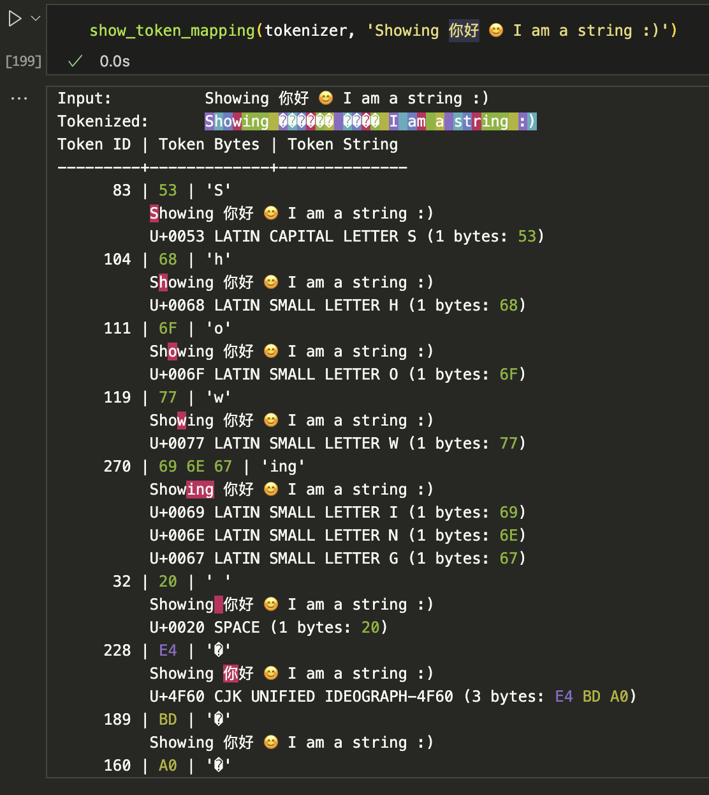
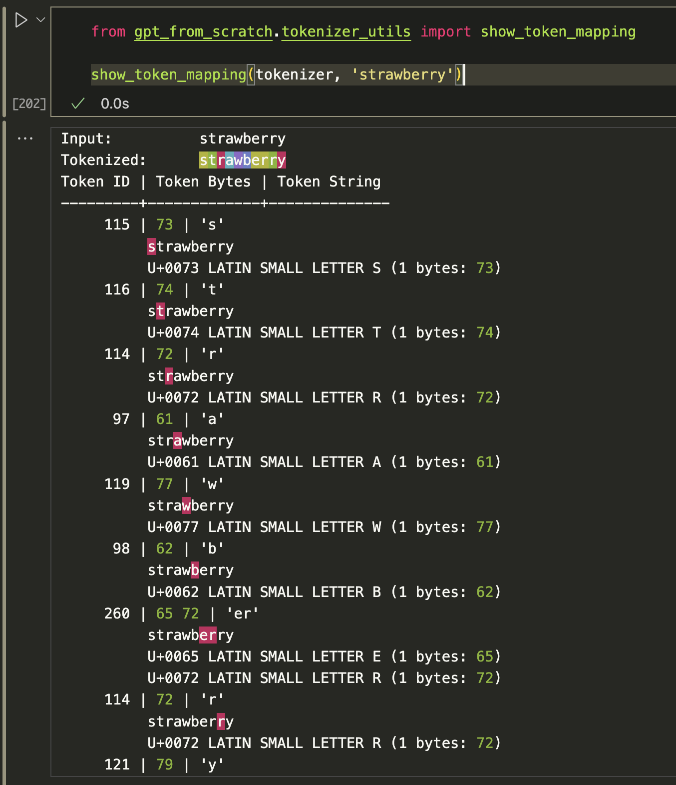
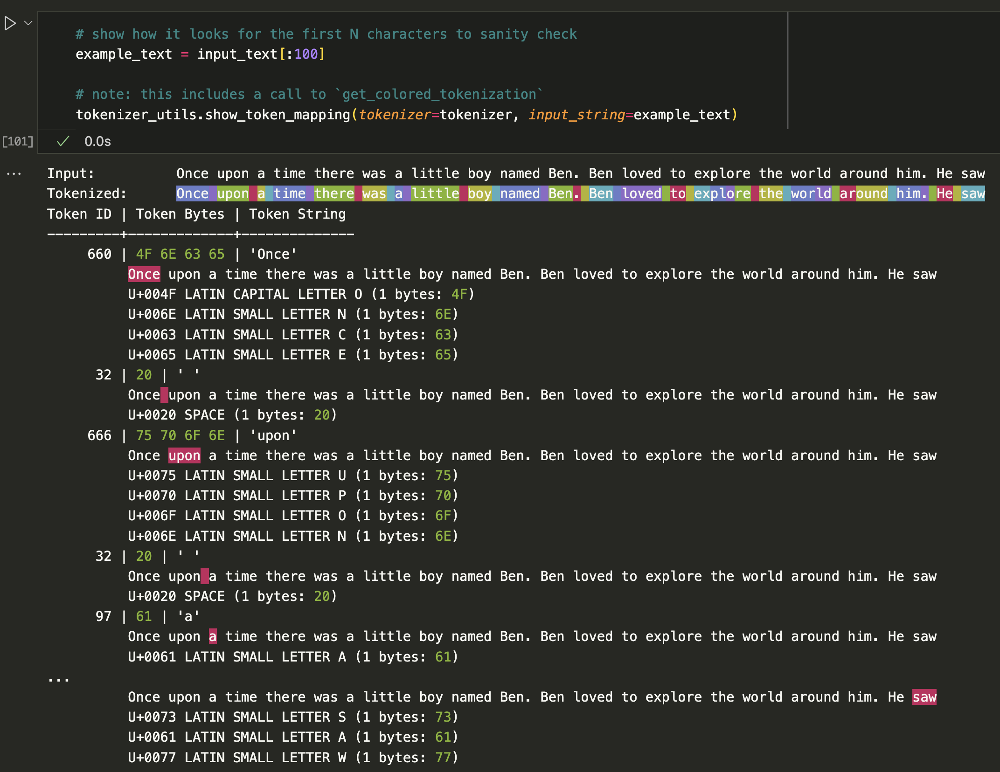
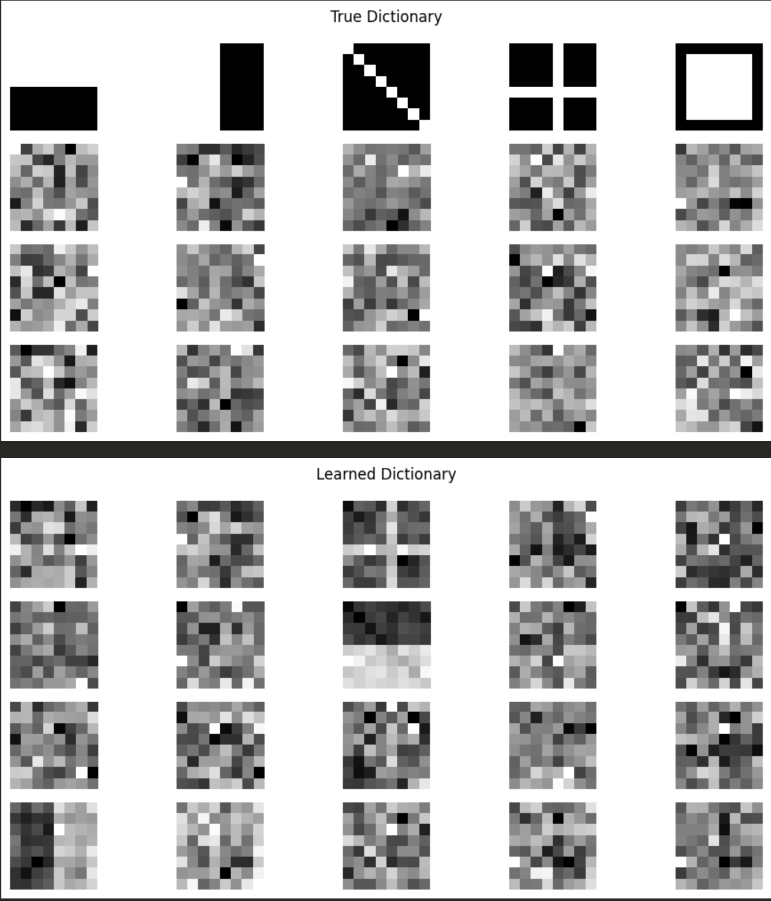
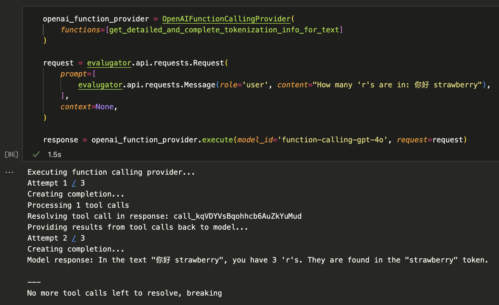
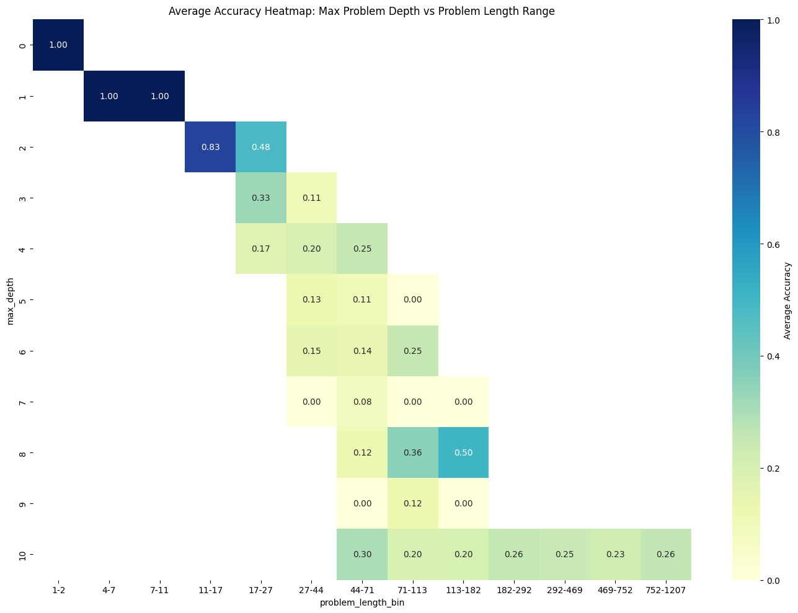

GPT from scratch via https://github.com/karpathy/nn-zero-to-hero


Table of Contents

- [Lecture 7: Let's build GPT: from scratch, in code, spelled out.](#lecture-7-lets-build-gpt-from-scratch-in-code-spelled-out)
  - [Code:  `gpt_from_scratch/bigram_with_self_attention.py`](#code--gpt_from_scratchbigram_with_self_attentionpy)
  - [Colab: `colab/bigram_with_self_attention.py`](#colab-colabbigram_with_self_attentionpy)
- [Lecture 8: Let's build the GPT Tokenizer](#lecture-8-lets-build-the-gpt-tokenizer)
  - [Byte Pair Encoder Tokenization](#byte-pair-encoder-tokenization)
- [Lecture 9: Let's Build GPT-2 From Scratch](#lecture-9-lets-build-gpt-2-from-scratch)
- [Custom Tokenization for TinyStories](#custom-tokenization-for-tinystories)
- [Example Dictionary Learning From Scratch With 2D Visualization](#example-dictionary-learning-from-scratch-with-2d-visualization)
- [Evalugator](#evalugator)
  - [With Function Calling](#with-function-calling)
  - [Custom Evaluation](#custom-evaluation)
- [Situational Awareness Dataset](#situational-awareness-dataset)


Includes:
 * jaxtyping annotations for all functions / variables
 * `mps` locally
 * dedicated `BytePairEncodingTokenizer` class with token mapping / colorization support
 * `evalugator` examples

Running tests:
```bash
python -m pytest
```

## Lecture 7: Let's build GPT: from scratch, in code, spelled out.

[Colab notebook](https://colab.research.google.com/drive/1JMLa53HDuA-i7ZBmqV7ZnA3c_fvtXnx-?usp=sharing#scrollTo=h5hjCcLDr2WC)

### Code:  `gpt_from_scratch/bigram_with_self_attention.py`

After running locally:

```python
Final loss:
Step 10000, Train Loss: 1.9295, Val Loss: 2.0263
Sampling at 10000:
---
Was caure come jiest
So-Vithith will doth courds, any the ur roant, this acuty-don
As and may no hom shall is not their it in an for hexh the'er what like say'll, the is so-me ored one amans for more 'tales would that thou dewith yeat that of theunk unto eming in my to Haty shall be your
Ans, and thers. Gher,
You her it to have him many you thou and ongs ast.

RANTIO:
Shall! hims.
Which make son bowes wards
as come, so my love for graebherrann tref.

QUEETY DET:
My live,
You that, a plice.
To no
---
```

### Colab: `colab/bigram_with_self_attention.py`

Same as above but run with much larger params:

```python
Step 3100, Train Loss: 1.0477, Val Loss: 1.4678
Sampling at 3100:
---

No, no; for the other bride unprovible
Mistakes to strength them: for, who should not from
```

Interestingly the above is the best it gets, after that it
starts to dramatically overfit (as seen by the increasing
val loss):

```python
Step 10000, Train Loss: 0.2645, Val Loss: 2.1802
Sampling at 10000:
---

Half an envious and the clouds upon him;
During him to all prove and cities shall find
The loving en
None
---
Output after optimizing:
---

For some known before I have said, and here I chance to sport:
Her father's grave and her stands, be not my sword.

Nurse:
Now blessed be the heart, and so bound afrend!

RATCLIFF:
No more, my lord: coward for me!

Nurse:
Marry, I say, I tell thee! she loves my heart!

RATCLIFF:

KING RICHARD III:
I would they were in the character.

Nurse:
Tybalt is gone, and Romeo banished;
Romeo that is banished, was the name;
And there is no thing, no, not he's more much.

RATCLIFF:
Make thy master.
```

---
  
## Lecture 8: Let's build the GPT Tokenizer

[Ref Colab Notebook](https://colab.research.google.com/drive/1y0KnCFZvGVf_odSfcNAws6kcDD7HsI0L?usp=sharing#scrollTo=pkAPaUCXOhvW)

### Byte Pair Encoder Tokenization




---

## Lecture 9: Let's Build GPT-2 From Scratch

[Ref Notebook](https://github.com/karpathy/build-nanogpt/blob/master/play.ipynb)

[Ref Repo](https://github.com/karpathy/build-nanogpt)

---

## Custom Tokenization for TinyStories



---

## Example Dictionary Learning From Scratch With 2D Visualization



---

## Evalugator

### With Function Calling

We then create an `openai` provider with function calling support:



Similar function calling and schema generation for `anthropic` (as well as tests) are provided as well

### Custom Evaluation

```python
from gpt_from_scratch.evals.arithmetic_eval import (
  arithmetic_eval,
  visualization,
)

# note: Returns json normalized `evalugator.evals.EvalResult`
df = arithmetic_eval.create_and_run_eval(
  model='gpt-4o-mini',
  max_depth=10,
  num_problems=10000,
)

visualization.plot_heatmap(df)
```




## Situational Awareness Dataset

> [!WARNING] As a precaution against unintentionally including anything from SAD in this repo, we do **not** have it as a submodule, and it instead must be cloned manually. It is also listed in `.gitignore`

```bash
> git clone https://github.com/LRudL/sad.git gpt_from_scratch/sad
> cd gpt_from_scratch/sad

# Install dependencies. (these should already be a part of `gpt_from_scratch`, but including
# here for completeness
> pip install -e .

# Unzip files necessary to run the tasks. See the section about unzip.sh for why you need that.
> ./unzip.sh --exclude-evals
```

Working, complete implementations with tests (anthropic variants in same repo):
* [FunctionCallHandler](https://github.com/b-schoen/gpt_from_scratch/blob/main/gpt_from_scratch/evals/function_calling/openai/function_call_handler.py#L29)
* [Evalugator - OpenAIFunctionCallingProvider](https://github.com/b-schoen/gpt_from_scratch/blob/main/gpt_from_scratch/evals/function_calling/openai/function_calling_provider.py#L38)
* [generate_json_schema_for_function](https://github.com/b-schoen/gpt_from_scratch/blob/main/gpt_from_scratch/evals/function_calling/openai/schemas.py#L46)